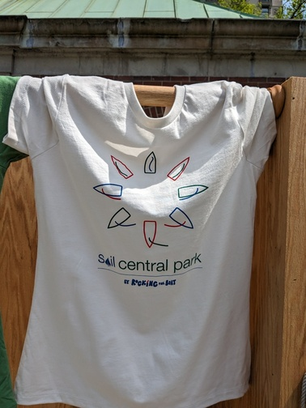
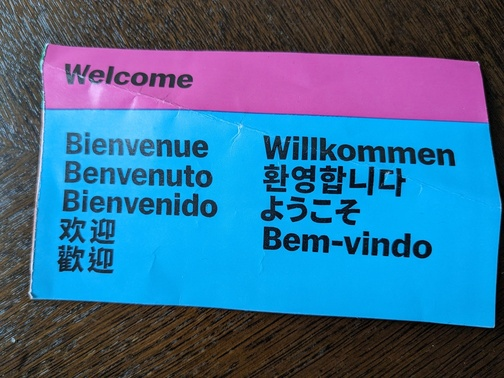
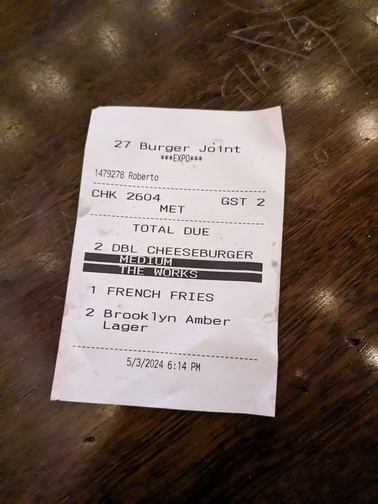
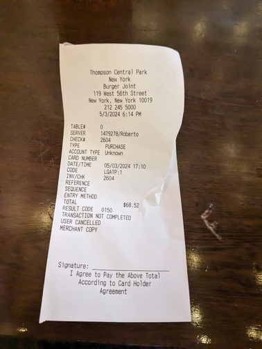
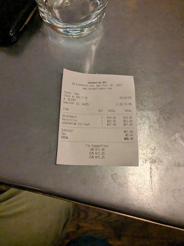
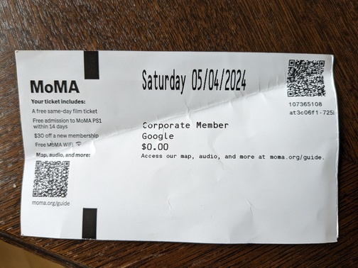
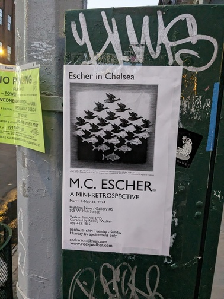
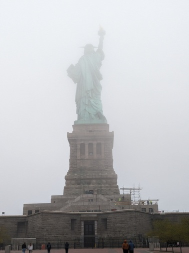
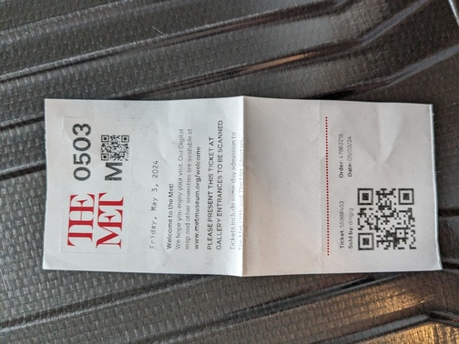

# Examples for labels computed using CLIP embeddings

Image|a t-shirt|a photo of a city|a photo of the statue of liberty|photo of a receipt|photo of a receipt of a burger restaurant|museum ticket|museum poster|something else
---|---|---|---|---|---|---|---|---
|0.999|0.000|0.000|0.000|0.000|0.000|0.000|0.000
|0.000|0.000|0.000|0.009|0.015|0.946|0.028|0.000
|0.000|0.000|0.000|0.011|0.989|0.000|0.000|0.000
|0.000|0.000|0.000|0.071|0.929|0.000|0.000|0.000
|0.000|0.000|0.000|0.122|0.878|0.000|0.000|0.000
|0.000|0.000|0.000|0.039|0.076|0.885|0.000|0.000
|0.000|0.000|0.000|0.000|0.002|0.004|0.993|0.000
|0.000|0.001|0.999|0.000|0.000|0.000|0.000|0.000
|0.341|0.016|0.006|0.127|0.035|0.168|0.156|0.151
|0.000|0.000|0.000|0.237|0.443|0.319|0.000|0.000
